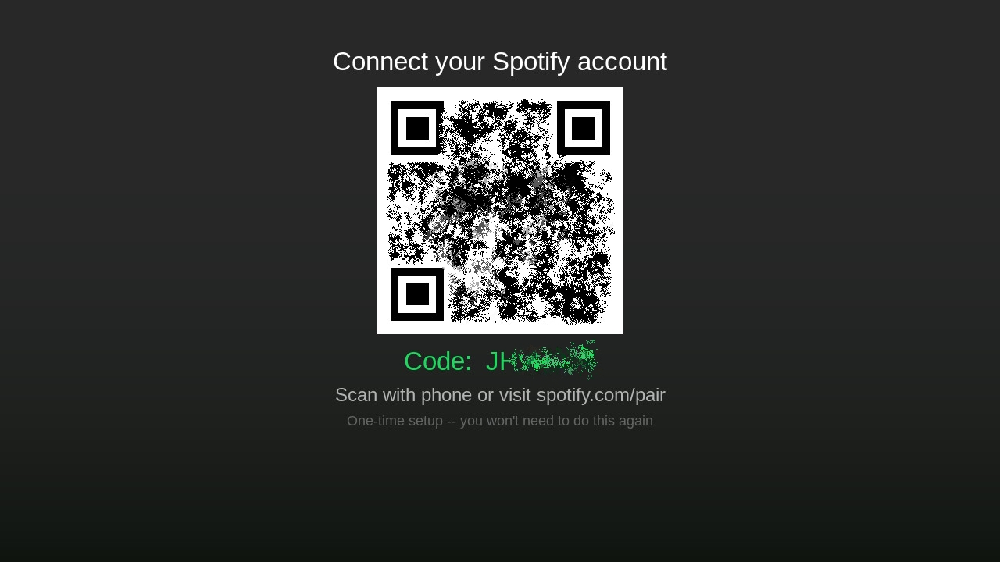

# NXpotify

An unofficial [Spotify Connect](https://www.spotify.com/connect/) client for the Nintendo Switch.
Based on https://github.com/Happynico7504/spotify-wiiu

> **Requires a Spotify Premium account.**
> Not affiliated with or endorsed by Spotify AB.




If zeroconf discovery does not work on your network, you can generate credentials manually with librespot:

```sh
librespot --name "nxpotify-setup" --cache /tmp/ls-cache
# open Spotify, select "nxpotify-setup", then Ctrl+C
python3 tools/make_creds.py /tmp/ls-cache/credentials.json
# copy the output spotify_saved_creds.bin to SD:/
```

## Building from source

### Prerequisites

- [devkitPro](https://devkitpro.org/wiki/Getting_Started) with the Switch dev package:

  ```sh
  dkp-pacman -S switch-dev
  ```

- **Tremor (integer Vorbis decoder)** -- install from portlibs or let the Makefile fall back to the vendored copy:

  ```sh
  dkp-pacman -S switch-libvorbisidec   # optional; Makefile detects it automatically
  ```

- **mbedTLS, libcurl, SDL2, SDL2_ttf** (all included in `switch-dev` or installable via dkp-pacman)

### Build

```sh
make         
```

Deploy to a Switch running a nxlink server:

```sh
nxlink -a <switch-ip> -s nxpotify.nro
```

Ported from [spotify-wiiu](https://github.com/Happynico7504/spotify-wiiu) by Nico Christmann.

## License

[MIT](LICENSE)
